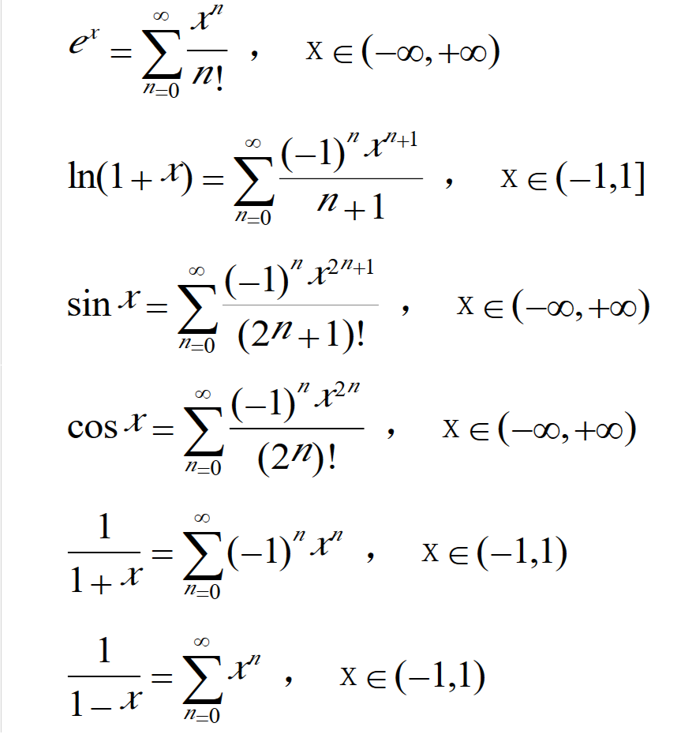

# Welcome to AZgeek!

---

##Useful websites
	
* <a href="https://www.google.com.hk/" target="_blank">Google</a>
* <a href="https://www.baidu.com/" target="_blank">Baidu</a>
* <a href="https://mail.163.com/" target="_blank">163 email log in</a>
* <a href="https://github.com/" target="_blank">Github</a>
* <a href="http://php.net/manual/zh/" target="_blank">PHP manual</a>
* <a href="http://www.runoob.com/" target="_blank">Runoob</a>
* <a href="https://1024tools.com/hmac" target="_blank">HMAC computing</a>
* <a href="https://ctf-wiki.github.io/ctf-wiki/" target="_blank">CTF-wiki</a>
* <a href="https://www.codecademy.com/" target="_blank">Codecademy</a>		
* <a href="https://developer.mozilla.org/zh-CN/docs/learn" target="_blank">MDN Learn Web</a>
* <a href="https://developer.mozilla.org/en-US/docs/Web/HTTP/CORS" target="_blank">MDN CORS</a>
* <a href="https://developer.mozilla.org/zh-CN/docs/Web/HTTP/Access_control_CORS" target="_blank">MDN CORS_cn</a>		
* <a href="https://www.jianshu.com/p/d433d9f89102" target="_blank">PHP black magic Jianshu</a>
* <a href="http://www.am0s.com/ctf/128.html" target="_blank">PHP CTF black</a>
* <a href="https://coolshell.cn/articles/5426.html" target="_blank">Learn Vim</a>
* <a href="https://www.liaoxuefeng.com/wiki/001434446689867b27157e896e74d51a89c25cc8b43bdb3000" target="_blank">Javascript Tutorial from Liaoxuefeng</a>
* <a href="https://www.liaoxuefeng.com/wiki/0014316089557264a6b348958f449949df42a6d3a2e542c000" target="_blank">Python3 Tutorial from Liaoxuefeng</a>
* <a href="http://linux.vbird.org/" target="_blank">Linux Vbird</a>
* <a href="https://www.jianshu.com/p/191d1e21f7ed" target="_blank">MarkDown grammer</a>
* <a href="http://www-cs-students.stanford.edu/~blynn//" target="_blank">Homepage of A  Stanford computer science student Ben Lynn</a>

---

$$x=y^2$$

##Some notes

###PHP
  
PHP int overflow: 如果给定的一个数超出了 integer 的范围，将会被解释为 float。同样如果执行的运算结果超出了 integer 范围，也会返回 float。  
PHP float to int:向下取整。

PHP 7.0.0 起，NaN 和 Infinity 在转换成 integer 时，不再是 undefined 或者依赖于平台，而是都会变成零。  

发现url中有?file=字样时可以修改后面为?file=php://filter/convert.base64-encode/resource=xxx.php来查看对应文件源码。  

###Javascript

Javascript中NaN这个特殊的Number与所有其他值都不相等，包括它自己。

###Probability and Mathematical Statistic

